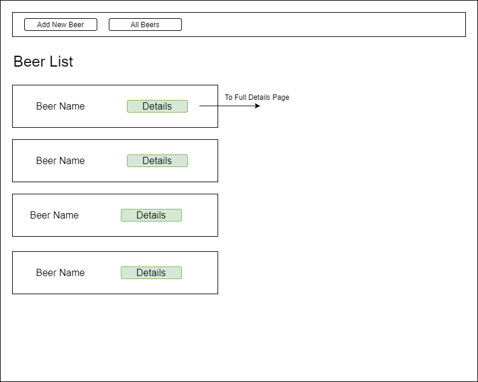
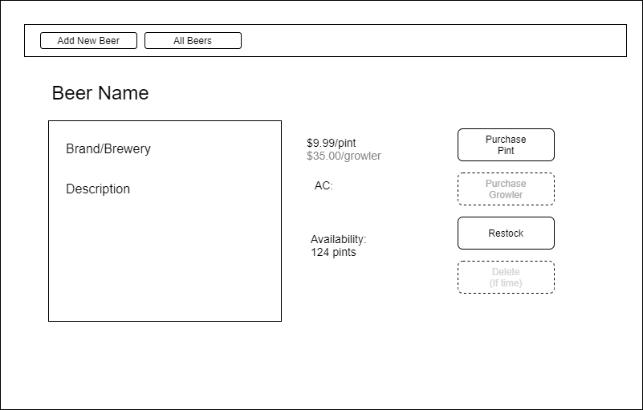
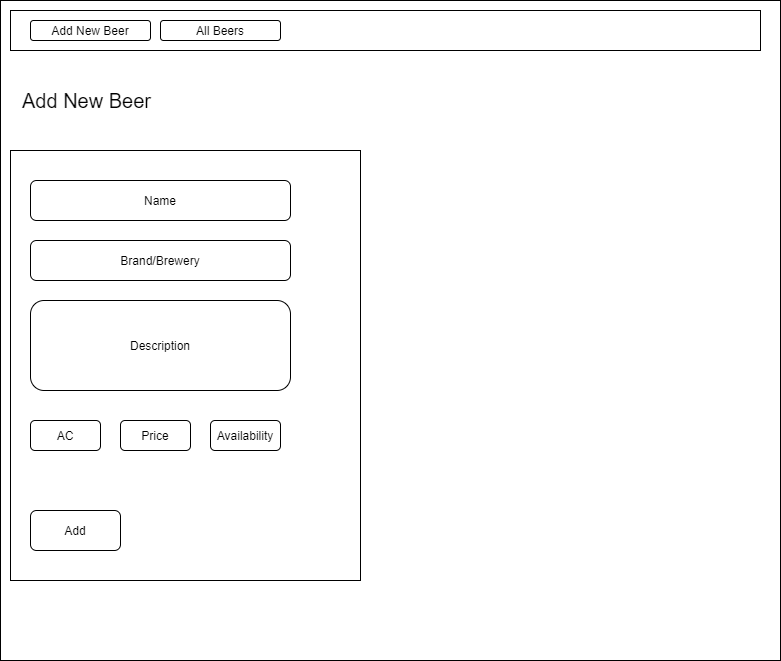

# Tap Room

#### By Kristen Hopper

## Technologies Used

* _HTML_
* _CSS_
* _JavaScript_
* _React_
* _npm_
* _webpack_

## Setup/Installation Requirements

1. Within your terminal, navigate to the directory you wish to clone the repository to
2. Clone the repository: `$ git clone https://github.com/krishops/tap-room.git`
3. Navigate to the tap-room directory and run `npm install` in the terminal
4. run `npm start` to start a development server at http://localhost:3000

## Description

This project demonstrates the use of React in building a website.
The following mock-ups show the initial plan for building this site.

## Known Bugs

* There are no known issues with this project.

## License

[MIT](https://opensource.org/licenses/MIT)

Copyright (c) Kristen Hopper

## Contact Information

hopperdavis@gmail.com